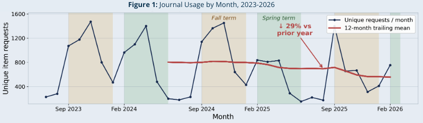
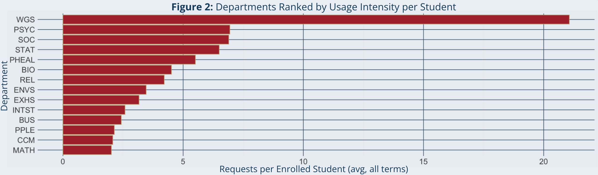
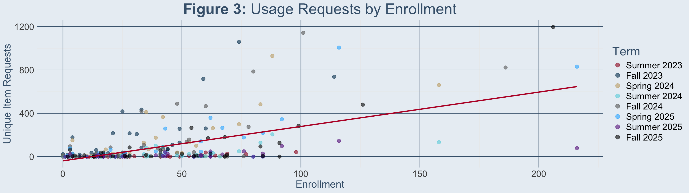

## Approach

We use exploratory analysis and descriptive statistics rather than predictive modeling. The stakeholder question is descriptive: which resources are being used, by whom, and how usage is changing over time. A predictive model would answer a question the librarians did not ask, and with under three years of monthly data there is not enough history to train or validate one honestly.

Usage is measured with COUNTER Unique Item Requests rather than Total Item Requests. Total Item Requests counts repeated views of the same article, and different publisher platforms inflate that count differently depending on how their interface serves PDFs and HTML full text. Unique Item Requests counts each article once per session, which makes comparisons across publishers meaningful.

Journals are grouped into five publisher packages: Springer, SAGE, Taylor & Francis, Oxford, and University of Chicago. The library subscribes at the package level rather than by individual title, so package is the unit at which a keep or cancel decision is actually made. The raw files contain nine distinct platform values because some publishers report across multiple platforms. SpringerLink, Springer Nature Link, and nature.com are all Springer content and were collapsed into a single Springer package. A small number of records listed ResearchGate as the platform. These are not part of any library subscription and were dropped.

Requests are aggregated to the term level to match the granularity of the enrollment data, which is only published per term. For department-level comparison we normalize by enrollment, reporting unique requests per enrolled student rather than raw request counts, so that a large department does not automatically appear more engaged than a small one.

One part of RQ1 could not be answered. The COUNTER reports contain no course or class identifier, and neither does the enrollment data, so there is no way to link a journal request to a specific class. We report on subject, department, and term, and treat the class-level dimension as out of scope rather than approximating it.

## Validation

There is no ground truth for what "correct" usage looks like, so validation focused on two things: whether the data supports the counts we report, and whether a finding survives reasonable alternative choices.

**Data integrity.** Oxford and Springer each supplied two export files covering overlapping time periods rather than one continuous file. Naively concatenating all seven spreadsheets double counts every journal and month that appears in both files, which inflates total requests by roughly 4.4%. We deduplicate at the journal and term level, taking the maximum value where the two files disagree, before any aggregation.

**Reporting floor.** Publisher COUNTER reports omit titles that received no requests in a given period. A blank cell therefore means "not reported," not "zero requests," and the minimum observed value in the data is one request rather than zero. This means the collection cannot be described in terms of unused journals, and any month-over-month comparison across the full title list would confuse a change in reporting with a change in usage. For the time series we restrict to the 1,493 journals that appear in every month of the window, so the panel is constant and the trend reflects usage rather than coverage.

**Coverage gaps.** March 2026 appears in the data for University of Chicago only. Including it would show an apparent collapse in usage that is entirely an artifact of four publishers not having reported yet. That month is excluded from all time series, which sets the analysis window at July 2023 through February 2026.

**Robustness.** The year-over-year decline was checked separately within the publishers that supplied a single continuous file, so it is not an artifact of the deduplication step, and it appears in each of them rather than in one. Where a result depends on a chosen cutoff, we tested it under several cutoffs and report it only where the conclusion holds across them.

## Figure 1: Journal Usage by Month, 2023-2026

{fig-alt="Line chart of unique item requests per month from July 2023 to February 2026, with a 12 month trailing mean showing a downward trend."}

*Journal usage by month, July 2023 to February 2026. Unique item requests per month, summed across the 1,493 journals reporting in every month of the window (n = 1,493). The red line is the 12 month trailing mean. March 2026 is excluded because only one of five publishers reported that month.*

Figure 1 shows total unique item requests per month from July 2023 through February 2026, restricted to the 1,493 journals that reported in every month of the window. The vertical axis is unique item requests per month across the whole collection. Shaded bands mark Fall and Spring terms.

Usage tracks the academic calendar closely. Requests peak in the middle of each term, fall off sharply during winter and summer breaks, and reach their yearly low in June and July. Fall consistently produces the highest sustained usage of the three terms.

The clearer finding is the direction of the trend. The twelve month trailing mean fell from roughly 787 unique requests per month to roughly 556, a decline of 29% over the most recent year. Because the panel of journals is held constant, this is not a reporting gap. The decline also appears within the publishers that supplied a single continuous export file, which rules out the deduplication step as a cause. We report the decline as real and note that this analysis cannot identify its cause. The rise of large language models as a research tool is one plausible explanation, but nothing in this data tests it.

One feature of the series should not be read as a recovery. The isolated spike in September 2025 is driven by a single newly activated journal title rather than a broad return to earlier usage levels, and the series returns to trend the following month.

## Figure 2: Departments Ranked by Usage Intensity per Student

{fig-alt="Horizontal bar chart ranking 14 departments by journal requests per enrolled student, with Women's and Gender Studies far ahead of the rest."}

*Journal requests per student broken down by department. Total unique item requests for each department divided by the average enrollment over all terms of available enrollment data.*

Figure 2 shows the number of journal requests per student within each department, averaged across all terms present (Summer 2023 to Fall 2025). The vertical axis displays the 14 departments with the highest requests per student. The horizontal axis denotes the number of requests per student.

Women's & Gender Studies (WGS) is a large outlier, with an average of 3.88 majors per term but 957 total requests. While 957 is not a particularly high number of requests (9th overall), the very low enrollment produces the outlier. There is no obvious single reason for this, but we hypothesize a mix of three things: popular research topics in WGS journals, which mostly focus on sexuality, gender identity, and women's studies; classes in other departments, such as PNCA's liberal arts, using WGS-labeled journals; and use by other campus organizations such as the Gender Resource & Advocacy Center (GRAC).

Psychology (PSYC) and Sociology (SOC) follow WGS with the next highest requests per enrolled student, with averages of 96.12 and 36.75 students per semester and 5,339 and 2,028 total requests respectively. These are much larger departments by enrollment and also have a higher volume of journals, both ranking in the top 5 for journal count. Public Health (PHEAL), Biology (BIO), and Environmental Science (ENVS) make up the rest of the top 5 departments by journal count and also have consistently high enrollment.

Statistics (STAT) ranks fourth in requests per student, which supports the idea that statistical methods are used across many other disciplines. The same can be said for other departments, so it is reasonable to assume that requests were made by a mix of students from different departments and other members of the Willamette community. Overall, this figure shows that enrollment is not a strong indicator of journal usage, given the variation and the volume of out-of-major journal usage by students, faculty, and staff alike.

## Figure 3: Usage Requests by Enrollment

{fig-alt="Linear model plot of journal requests by enrollment in each major and each term. Total requests aggregated."}

*Linear model of journal requests and entollment, broken down by each major and each term. Total requests aggregated each department and each term. Line of best fit trends upward with a slope of 0.85 and an intercept of -42.*

Figure 3 shows the relationship between enrollment and usage requests, total for each term and broken down by department/major. While there is a high amount of noise in this graphic, the upward trend remains noteworthy.

The slope of the line of best fit is 0.8503, meaning that for each additional student enrolled in that major, we expect journal usage to increase by an average of 0.85 requests. The slope was statistically significant (p < 0.001), indicating strong evidence that the relationship between enrollment and journal usage requests is not likely due to chance. The intercept (-42.03) is unexpected in the context of our problem. It suggests that an enrollment of 0 in a given term would be expected to have a negative number of usage requests, which is not possible.

The Pearson’s correlation coefficient is 0.666, which indicates a strong positive correlation between enrollment in a particular major for a given semester and requests for journals in that major in the same semester. Although we cannot conclude from this that higher enrollment causes higher usage, this relationship is present and notable.

The R-squared statistic is 0.4437, meaning that about 44% of the variation in the usage requests can be explained by enrollment. The remaining ~56% of variation is likely due to other factors that were discussed alongside Figure 2, such as out-of-major requests, having journal-heavy classes, or usage by others in the Willamette community.

While this overall trend is strong, there is substantial variability around the line for individual department-term combinations. The residual standard error is 145.2, meaning actual usage requests for a given department in a given term can differ from the model’s prediction by a wide margin, which is consistent with the visible scatter in Figure 3.
