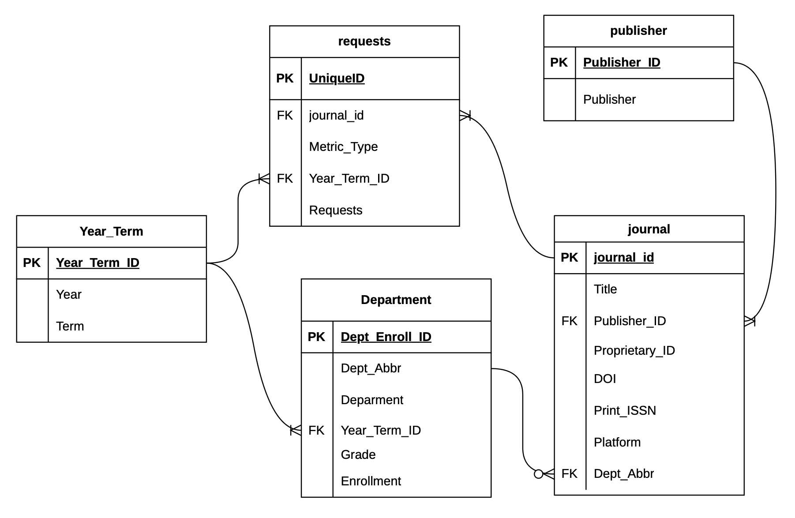
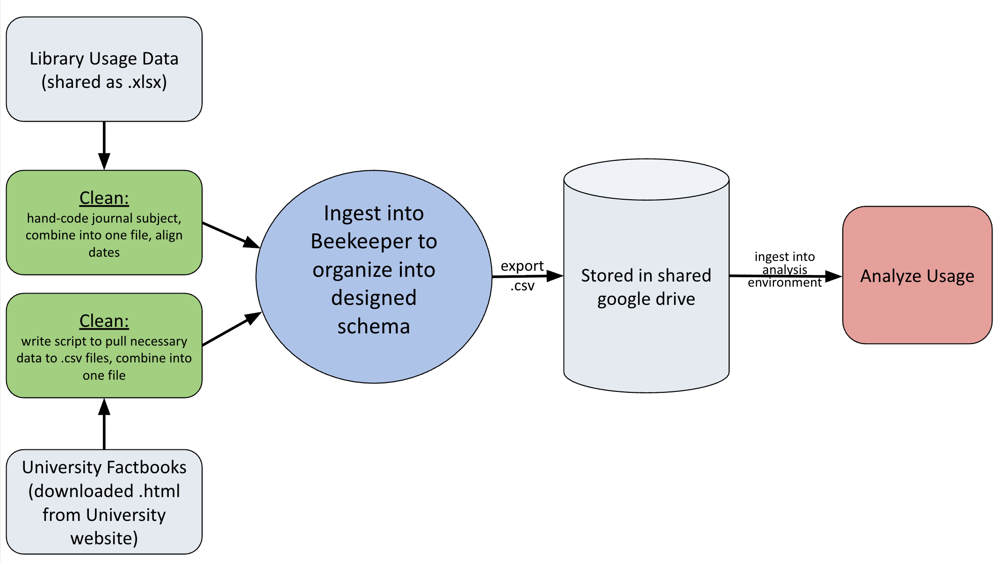

## The Sources

Our data comes from two sources: journal request data, and enrollment data.

##### Journal Data

The Willamette Library usage requests data was supplied to us by a contact at the WU Library. It contained 7 different spreadsheets from 5 different publishers: Oxford University, Sage, Springer Nature, University of Chicago and Taylor & Francis. Each of these consists of monthly data for the number of unique journal requests and the total number of journal requests. The unique item request only counts how many unique journals or articles within each journal was requested. Ultimately, we used the unique requests metric for our analysis. This data spans from July 2023 - March 2026. 

 

##### Enrollment Data

The enrollment data is publicly available on Willamette University’s website and contains each semester’s enrollment for every major broken down by sex and year in school. We chose the timespan to match the time for which we have journal requests data. This was from the Summer 2023-Fall 2025 (Spring 2026 data was not yet available at the time of our data ingestion). 

   

## The Wrangling

##### Journal Data

Since we wanted to analyze the relationship between enrollment in specific majors and the journal requests for journals in the same subject matter, we needed to classify each of the journals into their subject. This process was done manually. This proved to be challenging because there is some nuance as to what subject each journal belongs to. Journals were labeled with their closest related subject based on our discretion, which was then checked for accuracy by a WU librarian. The data was then all compiled into one file, ensuring that all of the month columns lined up, as different publishers have data for slightly different time periods. 

Since we are curious about looking at enrollment and the enrollment data is only as granular as each term, we summed each month for the journal data to also only consider the term. To do this we needed to assign each month to a term, which we did using the following logic:

| Term   | Months          |
|--------|-----------------|
| Fall   | August-December |
| Spring | January-April   |
| Summer | May-July        |

 

##### Enrollment Data

The enrollment data was stored as an .html online and we had to be downloaded as a .pdf. Before ingesting this data, we needed to write a script to read the data from the .pdfs to .csvs. We then combined all of this data into one file for ease in ingestion. We did not need to analyze the enrolled major counts by sex so we summed the M and F counts together to get the total count per grade for each major. We also dropped the supplied total counts in favor of creating our own calculations. Additionally, since we do not have enrollment data for the summer semesters, we had each summer adopt the previous spring’s enrollment data, as we assume that very few (if any) students are declaring their major in May-July. Once these steps were completed, the data was ready to be transformed into the new schema.

   

## The Schema

The data was downloaded and ingested into a PostgreSQL database where it was then loaded into staging tables. The new tables were then created and the data was inserted from the staging tables into the new organized tables, which contained appropriate foreign and primary keys to ensure ease in using joins for our analysis. Our organized schema can be seen below:

{width=70%}

   

## Analysis Ready

Once the data was in this format in the Postgres database, we exported each of the tables into .csv files so that we could download them into our analysis environments. These were in a shared google drive. This allowed us to easily perform our analysis asynchronously without having to re-wrangle the data every time we returned to the coding environment.

   

## Complete Pipeline

{width=70%}

After the process described above, the data was in the "Stored in shared google drive" stage, and is available for analysis.
